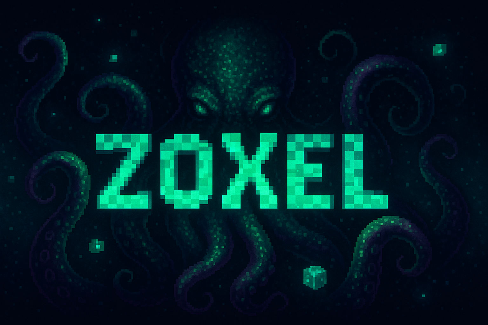

[](https://codeberg.org/deus/zoxel)

# 🐙 Zoxel — Embrace the Madness of the Voxels

In the shadowed depths where pixels twist and reality frays, **Zoxel** awakens. A procedural RPG forged in chaos, inspired by the ancient worlds of Warcraft, Minecraft, and Cube World — but beware: every block holds secrets older than time itself.

> *“Ph’nglui mglw’nafh Zoxel R’lyeh wgah’nagl fhtagn.”*  
> *(In its house at the corner of your screen, Zoxel waits dreaming.)*

---

## What is Zoxel?

- A procedural simulation RPG where the voxels whisper untold secrets
- Crafted with a flat, nimble architecture fueled by Flecs chaos
- Open-source, GPL-licensed — the abyss is free to all brave enough to dive
- Features: voxels, stats, items, skills, quests, and eldritch dialogues
- Venture forth… and uncover the madness lurking beneath the surface

---

## Play the Latest Ritual

Summon the freshest shadows from the depths:

- [_itch.io_](https://deus0.itch.io/zox) — Where the cult gathers  

---


## How Do I Summon Zoxel?

```bash
git clone https://codeberg.org/deus/zoxel
cd zoxel
make run
```

---

### The Tomes of Knowledge

The grand design awaits your eyes [ todo list ](https://codeberg.org/deus/zelder/src/branch/main/doc/tsk/todo.md)

For the arcane forge, peek at [_zoxelder_](https://codeberg.org/deus/zoxelder)

And the mysterious Flecs (v4.0.5) [_flecsing_](https://codeberg.org/deus/flecsing)

---

### Requirements

- **Build tools:**  
  - `git`  
  - `make`  
  - `gcc` (or compatible C compiler)  

- **Libraries:**  
  - math (`-lm`)  
  - pthreads (`-lpthread`)  
  - Flecs (`-lflecs`)  
  - SDL2 (`-lSDL2`)  
  - SDL2 image (`-lSDL2_image`)  
  - SDL2 mixer (`-lSDL2_mixer`)  
  - OpenGL (`-lGL`)

---

### Installing Dependencies

- **Debian / Ubuntu**

```bash
sudo apt install git gcc make libc6-dev libsdl2-dev libsdl2-image-dev libsdl2-mixer-dev libglew-dev
```

- **Arch Linux / Manjaro**

```bash
sudo pacman -S git gcc make glibc sdl2 sdl2_image sdl2_mixer glew
```

- **Alpine Linux**

```bash
sudo apk add git gcc make ibc-dev sdl2-dev sdl2_image-dev sdl2_mixer-dev glew-dev
```

---

### The Links

  - [ twitter ](https://twitter.com/deusxyz) — Whisper to the void
  - [ mastodon ](https://mastodon.gamedev.place/@deus) — The distant signal
  - [ youtube ](https://www.youtube.com/watch?v=Hseq5iPIJ6s) — See the shadows dance
  - [ codeberg ](https://codeberg.org/deus/zoxel) — The cryptic archive
  - [_github_](https://github.com/deus369/zoxel) — Will no longer be updated

---

*Dare you plunge into Zoxel’s depths? The voxels remember... but will you?*